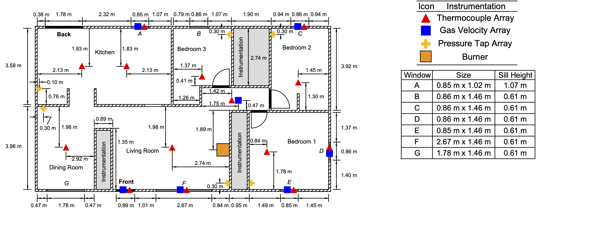
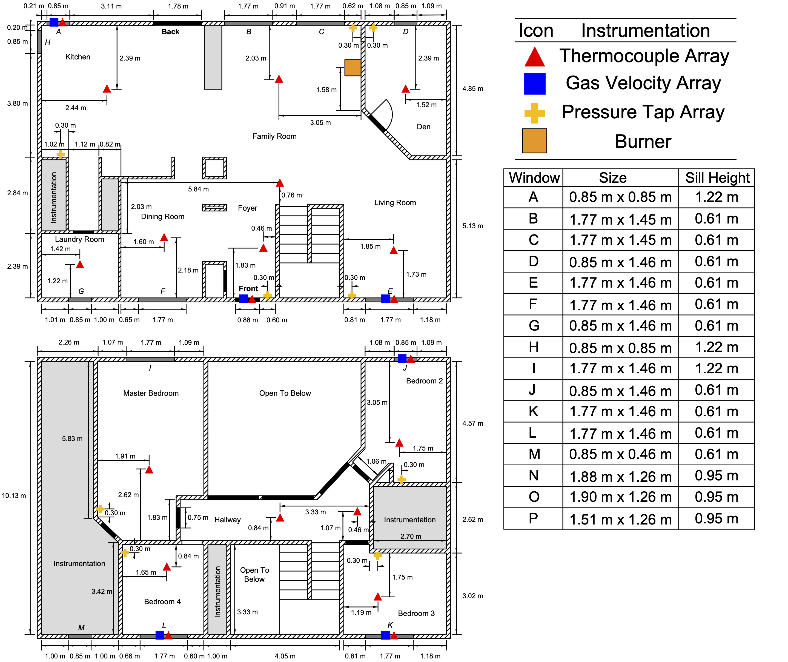

# Experimental Information

## Single Story Structure
The single-story, ranch-style structure had overall interior dimensions of 13.9 m by 7.7 m. The ceiling height was 2.4 m.

The locations of the instrumentation and the natural gas burner in the ranch-style structure are displayed below. Each thermocouple array consisted of eight type-K thermocouples. The highest elevation thermocouple in each array was located 2.5 cm below the ceiling with the remaining seven spaced at approximately 30.5 cm intervals (30.5 cm below ceiling, 61 cm below ceiling, ... , 213 cm below ceiling). 

Three pressure taps were installed at each location at elevations of 30.5 cm, 122 cm, and 213 cm below ceiling.  

Bi-directional velocity probes were installed in relevant doorways, windows, and the interior hallway of the single-story structure. In each case, the five probes in the array were evenly spaced along the centerline of the opening. The probes in the windows were spaced 24 cm apart. Therefore, the probe in the window openings at the highest elevation was 61 cm below the ceiling and the lowest elevation probe in the window openings was approximately 1.6 m below the ceiling. The probes in the front door opening were spaced 33 cm apart. The probe in the front door opening at the highest elevation was 73 cm below the ceiling and the lowest elevation probe was approximately 2.07 m below the ceiling. The probes in the hallway were spaced 40 cm apart. The probe in the hallway at the highest elevation was 40 cm below the ceiling and the lowest elevation probe was approximately 2.0 m below the ceiling.

## Two Story Structure
The two-story, colonial-style structure had overall interior dimensions of 15.05 m by 10.13 m. The ceiling height for each floor was 2.4 m.

The locations of the instrumentation and the natural gas burner in the colonial-style structure are displayed below. There were two 16-thermocouple arrays installed in the two-story structure: one in the family room and one in the foyer. The remainder of the thermocouple arrays had eight sensors. In all cases, the highest elevation thermocouple in each array was located 2.5 cm below the ceiling with the remaining thermocouples spaced at 30.5 cm intervals.

Three pressure taps were installed at each location at elevations of 30.5 cm, 122 cm, and 213 cm below the ceiling in all locations except the family room. Because the family room was open to the second story, the three elevations at which pressures were measured were 30.5 cm, 244 cm, and 460 cm below the ceiling.

Similar to the single-story structure, bi-directional velocity probes were installed in relevant doorways and windows. In each case, the five probes in the array were evenly spaced along the centerline of the opening.

